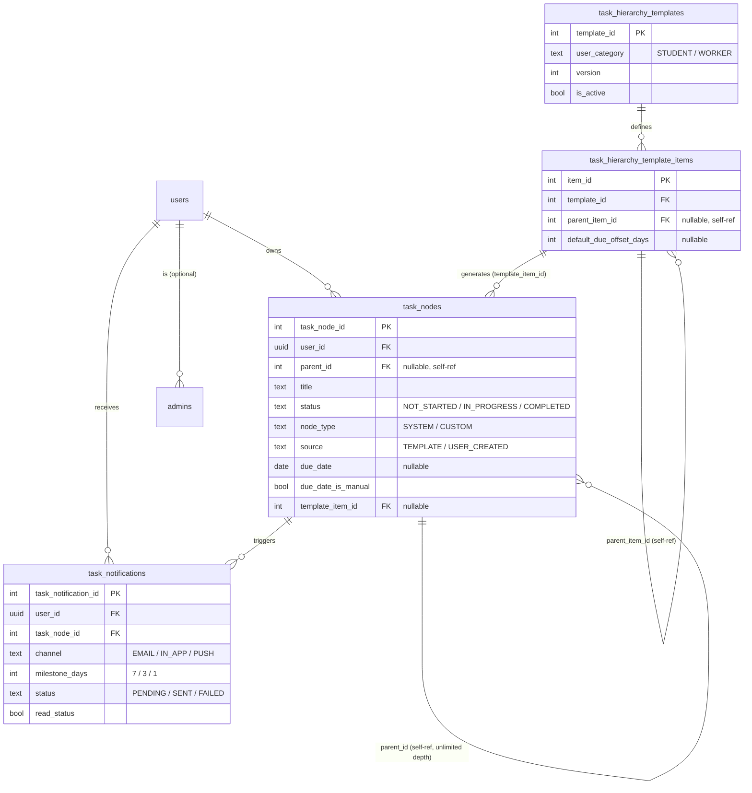
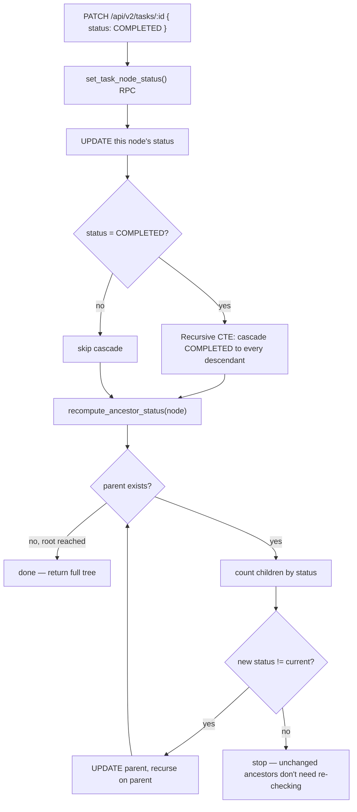
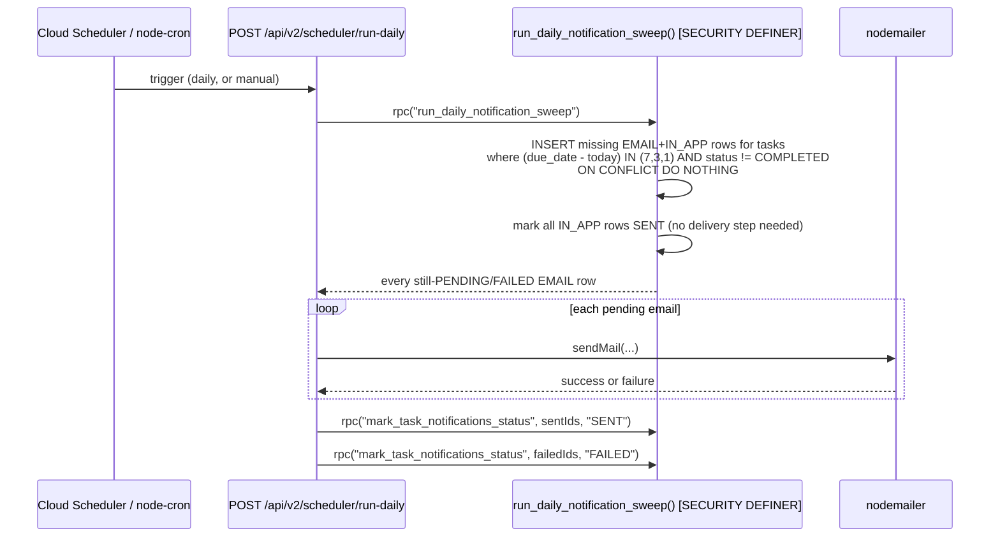

# Task Hierarchy & Notification System — Design & Implementation

**Status:** Implemented, additive, live at `/api/v2/*`
**Branch:** `feat/tasks-notification-sync`
**Relationship to the existing system:** runs alongside `TasksDashboard.jsx` / `TaskManager.jsx` / `Checklist.jsx` and the existing `/api/tasks`, `/api/notifications` routes. Nothing in this document renames, drops, or alters those — see [§0](#0-why-this-is-additive-not-a-replacement).

---

## 0. Why this is additive, not a replacement

The existing task system has three separate frontend pages reading three different, loosely-synced representations of "a task" (`user_tasks` + `task_templates` + `task_checklist`, stitched together partly via `localStorage`). That's the root cause of the syncing problems this brief asks to fix. Rebuilding it in place would mean touching those three pages and their shared state — out of scope for this iteration by explicit instruction, so this system is new tables, new routes, new services, mounted under a `/api/v2` prefix that the old pages never call. The old system keeps working exactly as it does today; this one is a clean foundation a future UI can be pointed at without a flag-day migration.

---

## 1. The core fix: one recursive table, not a task/subtask split

The old model's desync came from tasks and subtasks living in different tables with no shared lifecycle. The fix is a single `task_nodes` table where every row — root task or subtask at any depth — is the same kind of thing:

```sql
task_nodes(
  task_node_id, user_id, parent_id,      -- parent_id -> task_nodes.task_node_id, nullable
  title, description,
  node_type,            -- SYSTEM | CUSTOM
  source,                -- TEMPLATE | USER_CREATED
  status,                -- NOT_STARTED | IN_PROGRESS | COMPLETED
  priority, due_date, due_date_is_manual,
  template_item_id, sort_order, created_at, updated_at
)
```

A user-created task and a system-generated task are the same row shape (`node_type` + `source` just record where it came from) — user tasks "behave exactly like system tasks" by construction, not by parallel code paths.

---

## 2. ERD



Full DDL, RLS policies, and the sync functions below: [`backend/db/init/002_task_hierarchy_system.sql`](../backend/db/init/002_task_hierarchy_system.sql).

**Why `task_notifications` is a separate table from the existing `notifications` table:** the existing one is a flat, free-text, admin/community-alert table with no FK to any task. Reusing it here would mean either bolting structured columns onto a table other features depend on staying simple, or losing the FK relationship that makes idempotency and scheduling possible. A distinct table with a `task_node_id` FK and a `UNIQUE(task_node_id, channel, milestone_days)` constraint is what makes the "never send a duplicate reminder" requirement enforceable by the database itself rather than by application discipline.

---

## 3. Bidirectional status sync — the concurrency-critical fix

This is the part of the brief marked "CRITICAL FIX," so it gets the most careful treatment.

**The rules:**
- All children `COMPLETED` → parent becomes `COMPLETED`.
- Any child `IN_PROGRESS` (or a mix including some `COMPLETED`) → parent becomes `IN_PROGRESS`.
- Parent explicitly marked `COMPLETED` by the user → **every** descendant, at any depth, becomes `COMPLETED`.
- Nothing else cascades downward — setting a parent to `IN_PROGRESS` or `NOT_STARTED` does not force children into that state, since a user might complete some subtasks independently of the parent's own status. Only completion cascades down; everything else only rolls up.

**Why this lives in Postgres, not the Node service layer:** if "check siblings → compute new parent status → update parent → repeat for grandparent" were three or four separate `supabase-js` calls per level, two concurrent requests updating sibling tasks could interleave — request A reads the sibling set before request B's write commits, computes a stale parent status, and overwrites request B's correct one. Wrapping the whole cascade-and-roll-up chain in one Postgres function (`set_task_node_status`, called via `supabase.rpc()`) means it executes as a single transaction; Postgres's own MVCC guarantees serialize concurrent calls correctly. This is the same reasoning behind `set_task_node_due_date`, which rolls a parent's due date up to `MIN(children.due_date)` — unless a user has explicitly overridden it (`due_date_is_manual = true`), in which case roll-up stops at that node.



Application code: [`taskNodeRepository.setStatus`](../backend/src/repositories/taskNodeRepository.js) simply calls the RPC and returns the fresh, fully-consistent flat list, which [`taskNodeService.buildTree`](../backend/src/services/taskNodeService.js) turns into the nested response.

---

## 4. Template → task-tree generation algorithm

Templates are versioned (`UNIQUE(user_category, version)`) and **immutable once used**: [`templateService.generateTasksForUser`](../backend/src/services/templateService.js) checks whether the user already has any `source = 'TEMPLATE'` task before generating anything, so re-triggering onboarding (or a retried request) never produces duplicates, and editing a template later never silently changes tasks already assigned to existing users — the fix creates a new version instead.

Generation walks `task_hierarchy_template_items` **breadth-first, level by level**:

```
level = items with parent_item_id = NULL   (the roots)
itemIdToNodeId = {}

while level is not empty:
    insert task_nodes for every item in `level`,
        parent_id = itemIdToNodeId[item.parent_item_id]   (already known — it was inserted last iteration)
    record the new task_node_id for each inserted item back into itemIdToNodeId
    level = every item whose parent_item_id is one of this level's item_ids
```

This is the trick that makes unlimited nesting buildable with plain sequential batch inserts instead of a single recursive `INSERT ... WITH RECURSIVE` (which can't invent new auto-increment ids for a whole subtree in one statement): each level's parent ids are guaranteed to already exist in the map before the next level tries to reference them, because that's exactly the order they were inserted in. Due dates are computed as `arrival_date + default_due_offset_days` where an offset is defined; items with no offset get no due date, and therefore never enter the notification pipeline (satisfying "tasks without dates should not trigger reminders" for free — the scheduler's `WHERE due_date IS NOT NULL` filter is the only gate needed).

**Trade-off, stated plainly:** this runs as several sequential `INSERT`s from Node, not one atomic Postgres transaction, so a mid-generation crash could leave a partial tree. It's a one-time, low-concurrency operation (once per user, at onboarding), so this was judged an acceptable trade-off given the time available rather than moving it into a `plpgsql` function with a temp id-mapping table — flagged here rather than silently cut. The idempotency guard above means a retry after a partial failure is always safe.

---

## 5. Notification scheduler

**Idempotency, correctly enforced at the database, not the application:**

```sql
UNIQUE (task_node_id, channel, milestone_days)
```

The sweep function inserts with `ON CONFLICT (task_node_id, channel, milestone_days) DO NOTHING` — running it twice in one day, or twice a second by accident, can never create a duplicate reminder. This is stronger than a "check if it exists, then insert" pattern in application code, which has exactly the same race-condition problem as the status-sync logic above.



**Why a `SECURITY DEFINER` Postgres function instead of a service-role key:** the sweep has to read and write *every* user's rows, but this project's `.env` only has `SUPABASE_ANON_KEY` — no `SUPABASE_SERVICE_ROLE_KEY`. Rather than introduce a new secret to provision and protect, `run_daily_notification_sweep()` and `mark_task_notifications_status()` run as their owner (bypassing RLS internally, the same way Postgres table owners always do), while every other query in this system still only ever runs as the actual logged-in user. It's a narrower, more auditable privilege escalation than a blanket service key would be.

**Known trade-off: scheduler auth.** Cloud Scheduler has no human user to log in as, so `POST /api/v2/scheduler/run-daily` is gated by `requireAdminOrSchedulerSecret` (an admin JWT, *or* a header matching the `SCHEDULER_SECRET` env var) rather than `requireAuth` alone, and the two RPCs are consequently granted to `anon` as well as `authenticated` (see the migration file's comments). The real protection boundary is the `SCHEDULER_SECRET` check at the Express layer, not the Postgres grant. Closing this properly means either obtaining a service-role key for the scheduler process specifically, or provisioning a dedicated "system" Supabase Auth user whose JWT the cron job authenticates with — either is a reasonable follow-up, not done here for lack of a service-role key in this environment.

**Why Cloud Run needs the HTTP trigger, not just `node-cron`:** [`dailyNotificationScheduler.js`](../backend/src/schedulers/dailyNotificationScheduler.js) wires up `node-cron` for local development convenience (`ENABLE_NOTIFICATION_CRON=true`), but Cloud Run scales to zero — an in-process timer in an instance that isn't running never fires. The actual production trigger is Cloud Scheduler making an HTTP call to `POST /api/v2/scheduler/run-daily`, which works regardless of whether an instance was already warm.

**Multi-channel:** `channel` is `EMAIL | IN_APP | PUSH` today; `PUSH` rows can be inserted by the same sweep (add `('PUSH')` to the `CROSS JOIN` values in the migration) whenever a push provider is wired up — the schema and idempotency guarantee don't change.

---

## 6. Backend structure

Mapped onto the brief's requested layout, using this repo's existing top-level convention (`controllers/`, `routes/`, `services/` already exist) rather than introducing a second, parallel folder convention:

```
backend/src/
 ├── controllers/     taskNodeController.js, templateController.js,
 │                    taskNotificationController.js, schedulerController.js
 ├── services/        taskNodeService.js, templateService.js,
 │                    taskNotificationService.js, schedulerService.js
 ├── repositories/     taskNodeRepository.js, templateRepository.js,
 │                    taskNotificationRepository.js        (new top-level dir)
 ├── dtos/             taskNodeDto.js, templateDto.js,
 │                    taskNotificationDto.js                (new top-level dir)
 ├── schedulers/       dailyNotificationScheduler.js         (new top-level dir)
 ├── routes/           taskNodeRoutes.js, templateRoutes.js,
 │                    taskNotificationRoutes.js, schedulerRoutes.js
 ├── middleware/       authMiddleware.js  (extended: requireAdmin,
 │                    requireAdminOrSchedulerSecret, req.supabase)
 └── logger.js, services/mailer.js        (existing, reused as-is)
backend/db/init/
 └── 002_task_hierarchy_system.sql        (schema + RLS + sync functions)
```

Layering: **routes** parse nothing but the URL shape → **controllers** parse the request body and map errors to HTTP status codes → **services** hold business rules (validation, tree-building, the generation algorithm) → **repositories** are the only files that call `supabase.from(...)` or `supabase.rpc(...)`. DTOs sit between services and controllers, translating snake_case DB rows into the camelCase shape the API returns, and parsing request bodies into the shape services expect.

---

## 7. API reference

All routes require `Authorization: Bearer <supabase JWT>` (`requireAuth`) unless noted. Base path `/api/v2`.

| Method | Path | Description |
|---|---|---|
| GET | `/tasks` | Full hierarchical tree for the current user |
| POST | `/tasks` | Create a custom task (root, or child via `parentId`) |
| GET | `/tasks/:id` | One task with its nested `children` |
| PATCH | `/tasks/:id` | `{status}` **or** `{dueDate}` **or** `{title, description, priority}` |
| DELETE | `/tasks/:id` | Deletes the task and (via `ON DELETE CASCADE`) every descendant |
| POST | `/tasks/:taskId/children` | Create a subtask under `:taskId` |
| GET | `/tasks/:taskId/children` | Direct children only (not the full subtree) |
| GET | `/templates` | List active templates + their items |
| POST | `/templates` | **Admin only.** Create a template (+ optional items) |
| POST | `/users/:id/generate-tasks` | Self-service only — generates the caller's onboarding tree once |
| GET | `/notifications` | The current user's task-deadline notifications |
| PATCH | `/notifications/:id/read` | Mark one notification read |
| POST | `/scheduler/run-daily` | **Admin JWT or `X-Scheduler-Secret` header.** Runs the sweep now |

### Example — create a task

```http
POST /api/v2/tasks
Authorization: Bearer <jwt>
Content-Type: application/json

{ "title": "Open Bank Account", "description": "Visit RBC branch", "dueDate": "2026-09-10" }
```
```json
{
  "id": 101, "parentId": null, "title": "Open Bank Account",
  "description": "Visit RBC branch", "type": "CUSTOM", "source": "USER_CREATED",
  "status": "NOT_STARTED", "priority": "NORMAL",
  "dueDate": "2026-09-10", "dueDateIsManual": true,
  "createdAt": "2026-08-04T12:00:00Z", "updatedAt": "2026-08-04T12:00:00Z"
}
```

### Example — complete a subtask, see the parent roll up

```http
PATCH /api/v2/tasks/103/children  (was created under task 101 "Prepare College Application")
```
```http
PATCH /api/v2/tasks/103
{ "status": "COMPLETED" }
```
Response is the caller's **entire tree**, reflecting the just-recomputed parent status:
```json
[
  {
    "id": 101, "title": "Prepare College Application", "status": "IN_PROGRESS",
    "children": [
      { "id": 102, "title": "Collect transcripts", "status": "NOT_STARTED", "children": [] },
      { "id": 103, "title": "Upload documents",    "status": "COMPLETED",   "children": [] },
      { "id": 104, "title": "Pay application fee",  "status": "NOT_STARTED", "children": [] }
    ]
  }
]
```

### Example — generate onboarding tasks

```http
POST /api/v2/users/9c2c.../generate-tasks
```
```json
{ "generated": 3, "templateId": 1, "templateVersion": 1 }
```
A second call (or a retry) returns `{ "generated": 0, "reason": "already_generated" }` instead of duplicating the tree.

---

## 8. Auth & RBAC

- **Authentication** is unchanged from the rest of the app: Supabase Auth issues the JWT, `requireAuth` validates it. Supabase already handles password hashing and refresh-token rotation — this system doesn't reimplement either, since doing so would duplicate (and risk conflicting with) auth that already exists and works.
- **`req.supabase`** (new, additive in `authMiddleware.js`): a per-request client that forwards the caller's own JWT, so every query this system makes is subject to Postgres RLS as *that specific user* — the actual enforcement of "users manage their own tasks" is `CREATE POLICY ... USING (auth.uid() = user_id)` in the migration, not an `if` statement in a controller.
- **RBAC:** `requireAdmin` checks membership in the pre-existing `admins` table (present in the schema since before this work, never previously queried by any route). Admins can author templates (`POST /templates`); the corresponding RLS policy (`Admins manage templates`) enforces the same rule at the database level, so even a bug in `requireAdmin` couldn't let a non-admin's write through.
- Users can never generate tasks for anyone but themselves in this MVP (`templateController.generateTasks` returns `403` if `:id` != the caller's own id) — admin-triggered generation on someone else's behalf is a natural extension (would need its own `SECURITY DEFINER` function, the same pattern as the notification sweep) but wasn't built here.

---

## 9. Scalability notes

- **Per-user tree fetch is O(rows for that user), not O(all tasks in the system):** `idx_task_nodes_user` makes `GET /tasks` a single indexed scan; tree-building happens in Node over that already-small result set (a user's own tasks, typically dozens of rows, not thousands). A cross-user admin "all tasks" view, if built later, is where a `WITH RECURSIVE` CTE or a materialized path (`ltree`) would start to matter — not needed at the per-user scale this system operates at.
- **The scheduler scans by `due_date`,** not by user: `idx_task_nodes_due_date` (a partial index, `WHERE due_date IS NOT NULL`) keeps the daily sweep's cost proportional to tasks-with-deadlines across all users, not total task count, and it runs once a day, off the request path entirely.
- **Idempotency via `UNIQUE` + `ON CONFLICT`** (not a `SELECT`-then-`INSERT`) means the sweep is safe to run concurrently or to retry after a partial failure without a distributed lock.
- **Status/due-date writes are O(depth of the tree)** — the ancestor roll-up recurses upward, not across the whole table — so a user with several independent task trees pays no cost for other users' or their own other trees' size.
- At "thousands of users," the bottleneck this design anticipates first is the scheduler's single daily sweep touching every incomplete, dated task in one query; if that ever becomes slow, the natural next step is batching it by `user_id` range rather than redesigning the schema.

---

## 10. What was deliberately cut, and why

| Cut | Reason |
|---|---|
| Admin generates tasks for another user | Would need a second `SECURITY DEFINER` function; not needed for the MVP flow (users generate their own tasks at onboarding) |
| Atomic (single-transaction) template generation | One-time, low-concurrency operation; the idempotency guard makes a retry-after-partial-failure safe without it |
| Push notification delivery | Schema and idempotency already support a `PUSH` channel; no push provider is wired up yet, matching "future-ready" in the brief |
| Service-role key for the scheduler | Not present in this project's `.env`; used `SECURITY DEFINER` functions + a shared-secret header instead (see §5) |
| Frontend UI for this system | The brief's requirements are almost entirely backend/API; "add alongside, don't touch existing pages" further scoped this to backend-first. A new UI can be built against the documented API above without any backend changes. |

---

## 11. Testing

`backend/tests/`: `taskNodeService.test.js` (tree-building, unlimited nesting, ownership checks), `templateService.test.js` (category resolution, idempotent generation, breadth-first parent-id wiring across 3 levels), `schedulerService.test.js` (idempotency is delegated to the DB layer, partial-failure handling, status reporting), `taskNodeController.test.js` (PATCH branching between status/dueDate/plain-field updates), `authMiddleware.test.js` (`requireAdmin`, `requireAdminOrSchedulerSecret`). Run with `npm test` from `backend/`.
